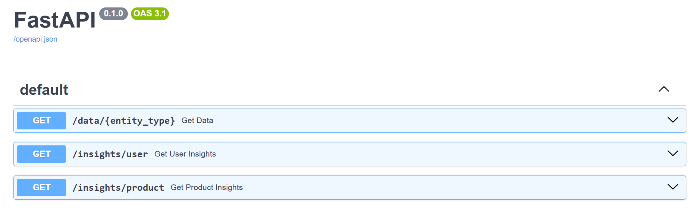

# Data Transformation Pipeline

<p align="center">
  
  
  
</p>

## Overview

This project implements a data transformation pipeline that fetches raw event data from multiple public APIs, normalizes and enriches it using business rules, and provides an API to query the processed data.

## Features

- Fetches data from three public sources:
  - E-commerce product data
  - User data
  - Transaction/order data
- Transforms and normalizes data into a unified format.
- Applies business rules:
  - Joins transaction data with product data to include product details.
  - Joins transaction data with user data for complete purchase records.
  - Calculates total spending per user.
  - Identifies the most popular product categories.
  - Computes the average transaction value.
- Provides FastAPI-based endpoints for querying processed data.

## Data Sources

The following public APIs are used:

1. **Products API**: [FakeStoreAPI](https://fakestoreapi.com/products)
   - Endpoint: `https://fakestoreapi.com/products`
   - Represents the product catalog.
2. **Users API**: [RandomUser API](https://randomuser.me/api/?results=20)
   - Endpoint: `https://randomuser.me/api/?results=20`
   - Represents user profiles.
3. **Transactions API**: [Mockaroo API](https://my.api.mockaroo.com/orders.json?key=e49e6840)
   - Endpoint: `https://my.api.mockaroo.com/orders.json?key=e49e6840`
   - Represents purchase transactions.

## Data Transformation

All fetched data is transformed into the following standardized format:

```json
{
    "entity_id": "generated-unique-id",
    "entity_type": "product|user|transaction",
    "timestamp": "ISO-8601-format",
    "data": {
        // Normalized fields from the source
    },
    "metadata": {
        "source": "which API",
        "processed_at": "processing timestamp"
    }
}
```

## API Endpoints

### **1. Retrieve Processed Data**

```http
GET /data/{entity_type}
```

- Fetches processed data based on entity type (`product`, `user`, or `transaction`).
- Example request:
  ```http
  GET /data/product

  Responce:
    [
      {
    "entity_id": "product-292f410a-ed0a-4732-a390-31da95e9b8dc",
    "entity_type": "product",
    "timestamp": "2025-03-09T02:11:16.011688+00:00",
    "data": {
      "id": 1,
      "title": "Fjallraven - Foldsack No. 1 Backpack, Fits 15 Laptops",
      "price": 109.95,
      "description": "Your perfect pack for everyday use and walks in the forest. Stash your laptop (up to 15 inches) in the padded sleeve, your everyday",
      "category": "men's clothing",
      "image": "https://fakestoreapi.com/img/81fPKd-2AYL._AC_SL1500_.jpg",
      "rating": {
        "rate": 3.9,
        "count": 120
      }
    },
    "metadata": {
      "source": "https://fakestoreapi.com/products",
      "processed_at": "2025-03-09T02:11:16.011702+00:00"
    }
  }
  ]
  ```

### **2. User Spending Insights**

```http
GET /insights/users
```

- Returns total spending per user.
- Example response:
  ```json
  {
      "user_spending": {
          "1234567890": 120.5,
          "0987654321": 200.75
      }
  }
  ```

### **3. Product Popularity Insights**

```http
GET /insights/products
```

- Identifies the most popular product categories.
- Example response:
  ```json
  {
      "most_popular_category": "electronics",
      "purchase_count": 45,
      "category_data": {
          "electronics": 45,
          "clothing": 30,
          "home": 20
      }
  }
  ```

### **4. Test the Endpoints Using Swagger UI**

FastAPI provides an interactive API documentation using Swagger UI. Once the server is running:

- Open your browser and go to: `http://127.0.0.1:8000/docs`
- You can interact with all the API endpoints directly from this interface.

Alternatively, you can use Redoc:

- Open `http://127.0.0.1:8000/redoc`

#### Swagger UI Preview

<p align="center">
  
</p>


## Project Setup Instructions

### **1. Clone the Repository**

```sh
git clone <repository-url>
cd <repository-name>
```

### **2. Create a Virtual Environment**
```sh
python -m venv .venv
On Windows use: .venv\Scripts\activate #on ios use source .venv/bin/activate  # 
```

### **3. Install Dependencies**

Ensure you have Python installed (version 3.8+ recommended). Then, install dependencies:

```sh
pip install -r requirements.txt
```

### **4. Run the Application**

Execute the following command to start the FastAPI server:

```sh
uvicorn main:app --reload
```

## File Structure

```
📂 project_root/
├── 📂 .venv/               # Virtual environment (optional)
├── 📂 app/
│   ├── api_calling.py      # Functions to fetch and transform data
│   ├── 📂 public/         # Contains Swagger UI screenshot
├── main.py                # FastAPI application entry point
├── .gitignore             # Git ignore file
├── README.md              # Documentation
├── requirements.txt       # Dependencies
```

## Approach Summary

1. **Data Ingestion**: Fetches data from the three public APIs.
2. **Data Transformation**: Converts raw data into a standardized JSON format.
3. **Data Enrichment**:
   - Transactions are linked with products and users.
   - User spending is calculated.
   - Product category popularity is analyzed.
4. **API Development**: Implements FastAPI endpoints to expose processed data and insights.

## 🚀 Data Pipeline Architecture Overview

### **1️⃣ Data Sources (Extract)**
- Fetches data from three external APIs:
  - **Products:** `https://fakestoreapi.com/products`
  - **Transactions:** `https://my.api.mockaroo.com/orders.json?key=e49e6840`
  - **Users:** `https://randomuser.me/api/?results=20`
- Uses a decorator (`@transform_response`) to:
  - Assign **UUIDs** for uniqueness
  - Attach **timestamps & metadata**
  - Maintain a **consistent structure**

### **2️⃣ Data Transformation (Enrichment)**
- **Product Enrichment** → Maps transactions to products (`parcel_id`)
- **User Enrichment** → Matches transactions to users (`user_phone`)
- Uses **dictionary-based lookups (`O(1)`)** for efficiency

### **3️⃣ Data Insights (Analytics Layer)**
- **User Analytics:**
  - Calculate **total spending per user**
  - Compute **average transaction value**
- **Product Analytics:**
  - Identify **most popular product category**
  - Compute **purchase count per category**

### **4️⃣ API Endpoints (Load & Serve)**
- **`/data/{entity_type}`** → Fetch raw data (products, users, transactions)
- **`/insights/user`** → Returns total spending per user
- **`/insights/product`** → Returns most popular product category & count

### **5️⃣ Performance Optimizations**
- **Single API Calls** → Fetches data **once per request**  
- **Fast Lookups** → Uses **dictionary-based mappings**  
- **Modular Design** → Functions are **independent & scalable**  

**Scalable, modular, and efficient! 🚀🔥**


## Error Handling

- **API failures**: Uses exception handling (`try-except`) to catch request errors.
- **Missing data**: Uses default values and empty structures to avoid crashes.

## Future Enhancements

- Implement persistent storage (e.g., SQLite, PostgreSQL) for better scalability.
- Introduce caching mechanisms to optimize API response time.
- Implement authentication and authorization mechanisms for data security.


